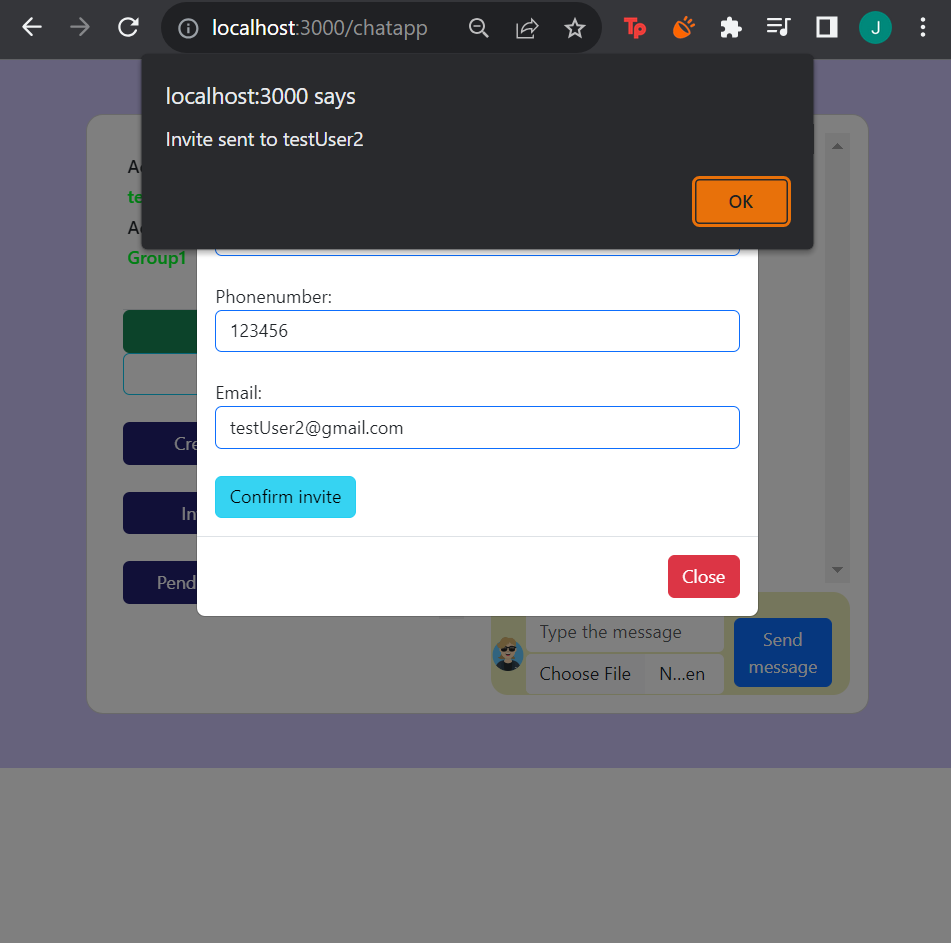

<h1 align="center" id="title">GroupChat Application</h1>

<p align="center"></p>

<p id="description">The Groupchat Platform is a web-based application that facilitates real-time communication and collaboration among its users. The platform aims to provide a seamless and interactive environment for individuals teams or communities to come together exchange ideas and build strong connections.This was build as part of my learning node js express and creating api's.</p>

<h2>Project Screenshots:</h2>
<p>Login Page</p>

<p>Signup Page</p>

<p>GroupChat Homepage</p>

<p>Invite Requests</p>

<p>Real time notification when invites are received </p>


<p>Pending Requests</p>

<p>Group Members</p>

<p>Real time conversation</p>


  
  
<h2>🧐 Features</h2>

Here're some of the project's best features:

*   User Registration and Authentication: Users can sign up for the platform with a unique username and password. Account authentication ensures a secure and personalized experience
*   Group Creation and Management: Users can create or join various groups based on their interests projects or affiliations. Group administrators have the ability to manage membership and moderate discussions.
*   Real-time Chat: The heart of the platform is its real-time chat functionality. Users can send text messages emojis and media files instantly fostering quick and dynamic conversations.
*   Multimedia Support: Users can share images videos documents and links within the chat to enhance communication and collaboration.
*   Notification System: The platform provides a notification system to keep users informed about new messages group invitations and important updates.

<h2>🛠️ Installation Steps:</h2>

<p>1. Clone the repository</p>
```
git clone https://github.com/JulianToppo/GroupChat.git
```
<p>2. Set the environment variables</p>

<p>3. Install node dependencies</p>

```
npm install
```

<p>4. Start the server</p>

```
npm start
```
<h2>💻 Built with</h2>

Technologies used in the project:

*   NodeJs
*   Express
*   Socket.io
*   Sequelize
*   Axios

<h2>🍰 Contribution Guidelines:</h2>

<b>Fork the Repository</b>:<br>
Fork the repository to your GitHub account. 

<b>Create a Branch:</b><br>
Create a new branch in your forked repository to work on your changes.

<b>Commit Changes:</b><br>
Make small focused commits with clear and descriptive messages. 

<b>Happy Contributing! Your contributions are valued and appreciated. Thank you!<b>

  
  


<h2>💖Like my work?</h2>

<p>
  <a href="https://www.linkedin.com/juliantoppo95" rel="nofollow noreferrer">
     LinkedIn
  </a> &nbsp; 
</p>
